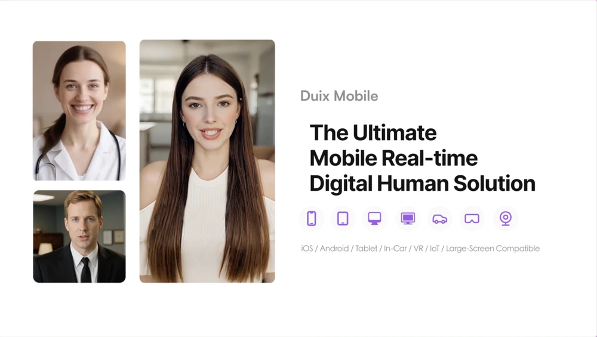

# Duix-Mobile 中文文档

中文 | [English](/README.md)

# 🚀🚀🚀 Duix Mobile —— 全网效果最好的移动端【实时对话数字人】

🔗 **官方网站**：[www.duix.com](http://www.duix.com)

**📱 跨平台支持：iOS / Android / 平板 / 车载系统 / VR设备 / IoT终端 / 大屏交互等**

## 😎 Duix Mobile 是什么？

本次由硅基智能开源的 Duix Mobile，是一个**可部署在手机或嵌入式屏幕的实时对话数字人 SDK**。

开发者可以轻松集成自有或第三方的大语言模型（LLM）、语音识别（ASR）和语音合成（TTS）服务，快速构建能与用户自然对话的数字人界面。

Duix Mobile 支持一键跨平台部署（Android/iOS），上手门槛低，适用于智能客服、虚拟医生、虚拟律师、虚拟陪伴、虚拟教学等多种应用场景。

现在就开始构建你自己的交互数字人，大幅提升你的产品业绩吧！

## 🤩 有哪些应用场景？

- Duix Mobile 在 Andorid/iOS/Pad/大屏等设备下可以支持到多种实际应用场景；
- 大幅度提升你的产品表现力，从而提升你的营收水平。

## 🥳 有什么优势？

- **仿真数字人体验**：自然呈现面部表情、语调和情绪共鸣，打造「像人一样」的 AI 对话。
- **支持流式音频**：边合成、边说话，支持中途打断、抢话，让数字人不仅会说话，而且更像「人」。
- **极致响应速度**：数字人响应延迟低于 120ms（测试设备为骁龙® 8 Gen 2 SoC），带来毫秒级流畅互动体验。
- **成本友好，随处部署**：轻量化运行，资源占用极低，轻松适配手机、平板、智能屏等终端。
- **无惧弱网环境**：核心处理本地完成，对网络依赖极低，尤其适合金融、政务、法律等高稳定性场景。
- **全行业适配**：模块化设计，支持快速定制，轻松打造各行业专属数字人解决方案。

## 📑 开发文档

- Android 开发者：[Duix Mobile SDK for Android](./duix-android/dh_aigc_android/README_zh.md)
- iOS 开发者：[Duix Mobile SDK for iOS](./duix-ios/GJLocalDigitalDemo/README_zh.md)

## 💚 实际部署案例

前往哔哩哔哩查看：
- [《程序员与奶奶的虚拟重逢》](https://www.bilibili.com/video/BV1QSgczPESS)
- [《Grok 遇见 Duix，谁才是你的真女友？》](https://www.bilibili.com/video/BV1Dbg3zbExC/)

## ✨ 公用数字人下载 

- 以下是 Duix 提供的 4 个公有数字人，可供下载和集成。

<table>
    <tr>
      <td align="center">
         
        <a href="https://github.com/duixcom/Duix.mobile/releases/download/v2.0.1/Leo.zip">下载</a>
      </td>
      <td align="center">
         
        <a href="https://github.com/duixcom/Duix.mobile/releases/download/v2.0.1/Oliver.zip">下载</a>
      </td>
      <td align="center">
         
        <a href="https://github.com/duixcom/Duix.mobile/releases/download/v2.0.1/Sofia.zip">下载</a>
      </td>
      <td align="center">
         
        <a href="https://github.com/duixcom/Duix.mobile/releases/download/v2.0.1/Lily.zip">下载</a>
      </td>
    </tr>
    </table>

## 🤗 如何定制私有数字人？

- 请发邮件至邮箱：`support@duix.com`

## 🙌 常见问题解答

我可以集成自己的大模型（LLM）、语音识别（ASR）和语音合成（TTS）吗？

当然可以，你可以将 Duix Mobile 的数字人与你的自己 LLM、ASR 和 TTS 进行集成。

是否支持「唇动同步」？

支持。

是否支持「多语种字幕」？

支持。

我如何创建自定义数字人？

我们提供了 8 个公有数字人，如需额外定制，请联系上方的企业微信。

通常录制 15 秒至 2 分钟的视频即可完成定制过程，简单便捷。

是否支持流式音频？

支持，流式音频已于 2025 年 7 月 17 日版本更新中上线。

是否提供数字人语音开始和结束的回调？

是的，我们提供语音开始和结束的回调文档。

## 📚 相关开源仓库

- GitHub: https://github.com/duixcom/Duix-Mobile
- Gitee: https://gitee.com/duix/Duix-Mobile
- GitCode: https://gitcode.com/openguiji/duix-mobile

## ❇️ Duix其他项目

- [Duix.com](http://Duix.com) - Easily integrable cloud-based real-time interactive AI avatar
- [Duix-Avatar](https://github.com/duixcom/Duix.Avatar) - The true open-source AI avatar video production
- [Duix-Reface](https://github.com/duixcom/Duix-Reface) - Truly open-source real-time, high-fidelity face-swap engine for AI avatar
