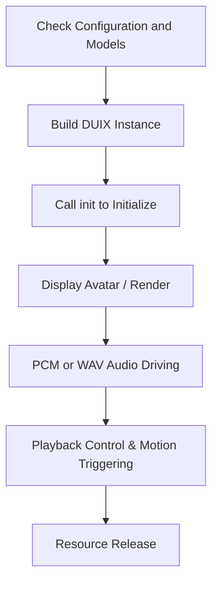

# Duix Mobile for Android SDK Documentation

English | [中文](./README_zh.md)

## 1. Product Overview

`Duix Mobile for Android` is a lightweight, fully offline 2D digital human solution for Android, supporting real-time rendering of digital avatars driven by voice audio.

### 1.1 Application Scenarios

- **Low deployment cost**: Suitable for unattended scenarios such as large-screen terminals, government halls, and banks.
- **Minimal network dependency**: Runs entirely locally, no internet required, stable operation in subways and remote areas.
- **Diverse functionality**: Can serve as a guide, Q&A customer service, intelligent companion, and more.

### 1.2 Core Features

- Customizable digital avatar and local rendering
- Real-time voice-driven playback (supports WAV playback and PCM streaming)
- Motion playback control (specific or random actions)
- Automatic resource download management

---

## 2. Terminology

| Term               | Meaning                                                                    |
|--------------------|----------------------------------------------------------------------------|
| PCM                | Pulse-Code Modulation, raw audio stream with 16kHz sample rate, 16-bit depth, Mono channel |
| WAV                | An audio file format that supports PCM encoding, suitable for short voice playback |
| RenderSink         | Rendering data reception interface, implemented by the SDK, can be used for custom rendering or default display |
| DUIX               | Main control object of the digital human, integrates model loading, rendering, broadcasting, and motion control |
| GLES               | OpenGL ES, a graphics interface for rendering images on Android               |
| SpecialAction      | A JSON file attached to the model that marks action intervals (e.g., greetings, waving) |

---

## 3. SDK Access

### 3.1 Module Reference (Recommended)

1. Obtain the complete source package, unzip it, and copy the `duix-sdk` directory to the project root directory.
2. In the project `settings.gradle`, add:

```gradle
include ':duix-sdk'
```

3. In the module's `build.gradle`, add the dependency:

```gradle
dependencies {
    api project(":duix-sdk")
}
```

### 3.2 AAR Reference (Optional)

1. Place the compiled `duix-sdk-release.aar` module into the `libs/` directory.
2. Add the dependency:

```gradle
dependencies {
    api fileTree(include: ['*.jar', '*.aar'], dir: 'libs')
}
```

---

## 4. Integration Requirements

| Item           | Description                                                     |
|----------------|-----------------------------------------------------------------|
| System         | Supports Android 10+ systems.                                    |
| CPU Architecture | armeabi-v7a, arm64-v8a                                           |
| Hardware Requirements | Device CPU with 8 or more cores (Snapdragon 8 Gen 2), 8GB or more memory, available storage space of 1GB or more |
| Network        | None (Fully local operation)                                    |
| Development IDE | Android Studio Giraffe 2022.3.1 Patch 2                         |
| Memory Requirements | Minimum 800MB memory available for the digital human          |

---

## 5. Usage Flow Overview



---

## 6. Key Interfaces and Example Calls

### 6.1 Model Check and Download

Before using the rendering service, ensure that the basic configuration and model files are synchronized to local storage. The SDK provides a simple demonstration of the model download and decompression process using `VirtualModelUtil`. If model download is slow or fails, developers can choose to cache the model package to their own storage service.

> Function Definition: `ai.guiji.duix.sdk.client.VirtualModelUtil`

```
// Check if base configuration is downloaded
boolean checkBaseConfig(Context context)

// Check if the model is downloaded
boolean checkModel(Context context, String name)

// Base configuration download
void baseConfigDownload(Context context, String url, ModelDownloadCallback callback)

// Model download
void modelDownload(Context context, String modelUrl, ModelDownloadCallback callback)
```

`ModelDownloadCallback` includes progress, completion, failure callbacks, etc., as defined in the SDK.

```
interface ModelDownloadCallback {
    // Download progress
    void onDownloadProgress(String url, long current, long total);
    // Unzip progress
    void onUnzipProgress(String url, long current, long total);
    // Download and unzip complete
    void onDownloadComplete(String url, File dir);
    // Download and unzip failed
    void onDownloadFail(String url, int code, String msg);
}
```

**Call Example**:

```kotlin
if (!VirtualModelUtil.checkBaseConfig(mContext)){
    VirtualModelUtil.baseConfigDownload(mContext, baseConfigUrl, callback)
}
```

```kotlin
if (!VirtualModelUtil.checkModel(mContext, modelUrl)){
    VirtualModelUtil.modelDownload(mContext, modelUrl, callback)
}
```

---

### 6.2 Initialization and Rendering Start

In the `onCreate()` stage of the rendering page, build the DUIX object and call the init interface.

> Function Definition: `ai.guiji.duix.sdk.client.DUIX`

```
// Build DUIX object
public DUIX(Context context, String modelName, RenderSink sink, Callback callback)

// Initialize DUIX service
void init()
```

**DUIX Object Construction Explanation**:

| Parameter     | Type      | Description                                                    |
|---------------|-----------|----------------------------------------------------------------|
| context       | Context   | System context                                                  |
| modelName     | String    | Can pass the model download URL (if downloaded) or cached filename |
| render        | RenderSink| Rendering data interface, SDK provides a default rendering component inheriting from this interface, or you can implement it yourself |
| callback      | Callback  | Various callback events handled by the SDK                      |

Where **Callback** is defined as: `ai.guiji.duix.sdk.client.Callback`

```
interface Callback {
    void onEvent(String event, String msg, Object info);
}
```

**Call Example**:

```kotlin
duix = DUIX(mContext, modelUrl, mDUIXRender) { event, msg, info ->
    when (event) {
        ai.guiji.duix.sdk.client.Constant.CALLBACK_EVENT_INIT_READY -> {
            initOK()
        }

        ai.guiji.duix.sdk.client.Constant.CALLBACK_EVENT_INIT_ERROR -> {
            initError()
        }
        // ...
    }
}
// Asynchronous callback result
duix?.init()
```

In the `init` callback, confirm the initialization result.

---

### 6.3 Digital Human Avatar Display

Use the SDK-provided `DUIXRenderer` and `DUIXTextureView` to quickly implement rendering with transparency support. Alternatively, you can implement the `RenderSink` interface to customize the rendering logic.

The **RenderSink** definition is as follows: `ai.guiji.duix.sdk.client.render.RenderSink`

```java
/**
 * Rendering pipeline, returns rendering data through this interface
 */
public interface RenderSink {

    // The frame's buffer data is arranged in BGR order
    void onVideoFrame(ImageFrame imageFrame);

}
```

**Call Example**:

Use `DUIXRenderer` and `DUIXTextureView` to quickly implement rendering. These controls support transparency and can freely set the background and foreground.

```kotlin
override fun onCreate(savedInstanceState: Bundle?) {
    super.onCreate(savedInstanceState)
    // ...
    mDUIXRender =
        DUIXRenderer(
            mContext,
            binding.glTextureView
        )

    binding.glTextureView.setEGLContextClientVersion(GL_CONTEXT_VERSION)
    binding.glTextureView.setEGLConfigChooser(8, 8, 8, 8, 16, 0) // Transparency
    binding.glTextureView.isOpaque = false           // Transparency
    binding.glTextureView.setRenderer(mDUIXRender)
    binding.glTextureView.renderMode =
        GLSurfaceView.RENDERMODE_WHEN_DIRTY      // Must be called after setting the renderer

    duix = DUIX(mContext, modelUrl, mDUIXRender) { event, msg, _ ->
    }
    // ...
}
```

---

### 6.4 Broadcasting Control

#### Use Streaming PCM to Drive Digital Human Broadcasting

**PCM Format: 16kHz sample rate, single channel, 16-bit depth**

> Function Definition: `ai.guiji.duix.sdk.client.DUIX`

```
// Notify service to start pushing audio
void startPush()

// Push PCM data
void pushPcm(byte[] buffer)

// Finish a segment of audio push (Call this after the audio push is complete, not after playback finishes)
void stopPush()
```

`startPush`, `pushPcm`, and `stopPush` need to be called in pairs. `pushPcm` should not be too long. After pushing the entire audio, call `stopPush` to end the session. Use `startPush` again for the next audio.

**The audio data between each startPush and stopPush segment should be at least 1 second (32000 bytes), otherwise the mouth shape driver cannot be triggered, and blank frames can be used to fill in.**

**Call Example**:

```kotlin
val thread = Thread {
            duix?.startPush()
            val inputStream = assets.open("pcm/2.pcm")
            val buffer = ByteArray(320)
            var length = 0
            while (inputStream.read(buffer).also { length = it } > 0){
                val data = buffer.copyOfRange(0, length)
                duix?.pushPcm(data)
            }
            duix?.stopPush()
            inputStream.close()
}
thread.start()
```

---

### 6.5 Motion Control

#### Play Specific Motion Interval

The model supports new motion intervals marked in `SpecialAction.json`

> Function Definition: `ai.guiji.duix.sdk.client.DUIX`

```
/**
 * Play specific motion interval
 * @param name The motion interval name, which can be obtained from @{ModelInfo.getSilenceRegion()} after init callback
 * @param now Whether to play immediately: true: play now; false: wait for current silent or motion interval to finish
 */
void startMotion(String name, boolean now)
```

**Call Example**:

```kotlin
duix?.startMotion("Greeting", true)
```

#### Randomly Play Motion Interval

> Function Definition: `ai.guiji.duix.sdk.client.DUIX`

```
/**
 * Randomly play a motion interval
 * @param now Whether to play immediately: true: play now; false: wait for current silent or motion interval to finish
 */
void startRandomMotion(boolean now);
```

**Call Example**:

```kotlin
duix?.startRandomMotion(true)
```

---

## 7. Proguard Configuration

If using obfuscation, add the following in `proguard-rules.pro`:

```proguard
-keep class ai.guiji.duix.DuixNcnn{*; }
```

---

## 8. Precautions

1. Ensure that the base configuration file and model are downloaded to the specified location before driving rendering initialization.
2. PCM audio should not be too long, as PCM buffers are cached in memory; long audio streams may cause memory overflow.
3. To replace the preview model, modify the `modelUrl` value in `MainActivity.kt` and use the SDK's built-in file download and decompression management to obtain the complete model files.
4. Audio driving format: 16kHz sample rate, single channel, 16-bit depth.
5. Insufficient device performance may result in the audio feature extraction speed not matching the playback speed. You can use `duix?.setReporter()` to monitor frame rendering information.

---

## 9. FAQ and Troubleshooting Guide

| Issue                          | Possible Cause               | Solution                     |
|---------------------------------|------------------------------|------------------------------|
| init callback failed            | Model path error or model not downloaded | Use `checkModel` to check model status |
| Rendering black screen          | EGL configuration or texture view error | Use SDK-provided example settings |
| No PCM playback effect          | Incorrect format or `startPush` not called | Ensure audio format is correct and call push method |
| Model download slow             | Unstable network or restricted CDN | Support self-hosted model file storage service |

---

## 10. Version History

**<a>4.0.1</a>**

1. Supports PCM audio stream driving the digital human, improving audio playback response speed.
2. Optimized motion interval playback, allowing specific motion intervals based on model configuration.
3. Custom audio player, removed Exoplayer playback dependency.
4. Provided simplified model download synchronization management tools.
5. The audio data between each startPush and stopPush segment should be at least 1 second (32000 bytes), otherwise the mouth shape driver cannot be triggered, and blank frames can be used to fill in.

**<a>3.0.5</a>**

```text
1. Updated arm32 CPU libonnxruntime.so version to fix compatibility issues.
2. Modified motion interval playback function, supports random and sequential playback, requires manual call to stop playback to return to silent interval.
```

**<a>3.0.4</a>**

```text
1. Fixed model display issue due to low float precision on some devices.
```

**<a>3.0.3</a>**

```text
1. Optimized local rendering.
```

## 11. 🔗 Open-source Dependencies

| Module                                   | Description                    |
|------------------------------------------|--------------------------------|
| [onnx](https://github.com/onnx/onnx)     | General AI model standard format |
| [ncnn](https://github.com/Tencent/ncnn)  | High-performance neural network computing framework (Tencent) |

---

For more help, please contact the technical support team.