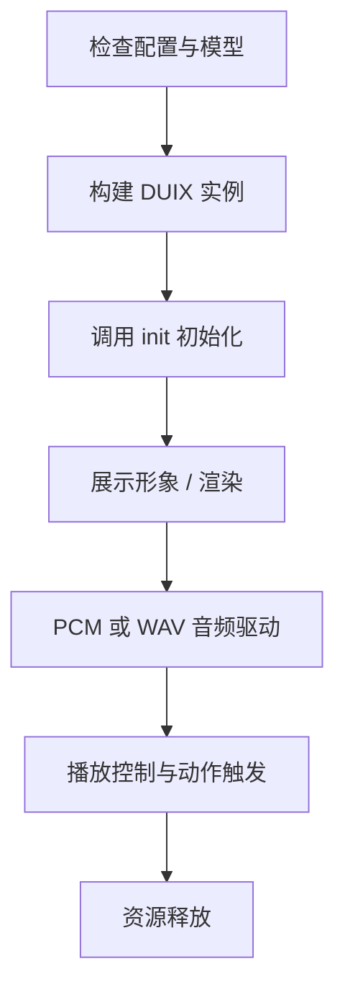

# Duix Mobile for Android SDK 文档

中文 | [English](./README.md)

## 一、产品介绍

`Duix Mobile for Android` 是一套轻量级、纯离线的 Android 平台 2D 虚拟人解决方案，支持通过语音音频驱动数字人形象并进行实时渲染。

### 1.1 应用场景

- **部署成本低**：适用于大屏终端、政务展厅、银行等无人值守场景。
- **网络依赖小**：完全本地运行，无需联网，可在地铁、偏远地区稳定运行。
- **功能多样化**：可服务于导览讲解、问答客服、智能陪伴等多种业务形态。

### 1.2 核心功能

- 数字人形象定制与本地渲染
- 实时语音驱动播报（支持 WAV 播放和 PCM 推送）
- 动作播放控制（指定动作、随机动作）
- 资源自动下载管理

---

## 二、术语说明

| 术语                | 含义                                                                     |
|-------------------|------------------------------------------------------------------------|
| PCM               | Pulse-Code Modulation，16kHz 采样率、16bit 位深、Mono 单通道的原始音频流                |
| WAV               | 一种音频文件格式，支持 PCM 编码，适合短语音播放                                             |
| RenderSink        | 渲染数据接收接口，由 SDK 提供实现，可用于自定义渲染或默认展示                                      |
| DUIX              | 数字人主控对象，集成了模型加载、渲染、播报、动作等能力                                            |
| GLES              | OpenGL ES，Android 渲染图像用到的图形接口                                          |
| SpecialAction     | 模型附带的 JSON 文件，标注动作区间（例如打招呼、挥手等）                                        |

---

## 三、SDK 获取方式

### 3.1 Module 引用（推荐）

1. 获取完整源码包，解压后将 `duix-sdk` 目录复制到项目根目录下。
2. 在项目 `settings.gradle` 中添加：

```gradle
include ':duix-sdk'
```

3. 在模块 `build.gradle` 中添加依赖：

```gradle
dependencies {
    api project(":duix-sdk")
}
```

### 3.2 AAR 引用（可选）

1. 将duix-sdk模块编译的 `duix-sdk-release.aar` 放入 `libs/` 目录。
2. 添加依赖：

```gradle
dependencies {
    api fileTree(include: ['*.jar', '*.aar'], dir: 'libs')
}
```

---

## 四、集成要求

| 项目     | 描述                                                 |
|--------|----------------------------------------------------|
| 系统     | 支持 Android 10+ 系统。                                 |
| CPU架构  | armeabi-v7a, arm64-v8a                             |
| 硬件要求   | 要求设备 CPU8 核及以上(骁龙8 Gen2),内存 8G 及以上。可用存储空间 1GB 及以上。 |
| 网络     | 无（完全本地运行）                                          |
| 开发 IDE | Android Studio Giraffe 2022.3.1 Patch 2            |
| 内存要求   | 可用于数字人的内存 >= 800MB                                 |


**编译项目的Gradle使用的JDK版本为17,需要在File->Setting->Build,Execution,Deployment->Grade Projects->Gradle JDK: ${选择一个17版本的JDK}**

---

## 五、使用流程概览



---

## 六、关键接口与调用示例

### 6.1. 模型检查及下载

使用渲染服务前需要将基础配置及模型文件同步到本地存储中,SDK中提供了VirtualModelUtil简单演示了模型下载解压流程。
若模型下载过慢或无法下载，开发者可以选择将模型包缓存到自己的存储服务。

> 函数定义: `ai.guiji.duix.sdk.client.VirtualModelUtil`

```
// 检查基础配置是否已下载
boolean checkBaseConfig(Context context)

// 检查模型是否已下载
boolean checkModel(Context context, String name)

// 基础配置下载
void baseConfigDownload(Context context, String url, ModelDownloadCallback callback)

// 模型下载
void modelDownload(Context context, String modelUrl, ModelDownloadCallback callback)
```

`ModelDownloadCallback` 包含进度、完成、失败等回调，详见 SDK 定义。

```
interface ModelDownloadCallback {
    // 下载进度
    void onDownloadProgress(String url, long current, long total);
    // 解压进度
    void onUnzipProgress(String url, long current, long total);
    // 下载解压完成
    void onDownloadComplete(String url, File dir);
    // 下载解压失败
    void onDownloadFail(String url, int code, String msg);
}
```

**调用示例**:

```kotlin
if (!VirtualModelUtil.checkBaseConfig(mContext)){
    VirtualModelUtil.baseConfigDownload(mContext, baseConfigUrl, callback)
}
```

```kotlin
if (!VirtualModelUtil.checkModel(mContext, modelUrl)){
    VirtualModelUtil.modelDownload(mContext, modelUrl, callback)
}

```

---

### 6.2. 初始化与渲染启动

在渲染页onCreate()阶段构建DUIX对象并调用init接口

> 函数定义: `ai.guiji.duix.sdk.client.DUIX`

```
// 构建DUIX对象
public DUIX(Context context, String modelName, RenderSink sink, Callback callback)

// 初始化DUIX服务
void init()
```

**DUIX对象构建说明**:

| 参数         | 类型         | 描述                                  |
|------------|------------|-------------------------------------|
| context    | Context    | 系统上下文                               |
| modelName  | String     | 可以传递模型下载的URL(已下载完成)或缓存的文件名          |
| render     | RenderSink | 渲染数据接口，sdk提供了默认的渲染组件继承自该接口，也可以自己实现  |
| callback   | Callback   | SDK处理的各种回调事件                        |


其中**Callback**的定义: `ai.guiji.duix.sdk.client.Callback`

```
interface Callback {
    void onEvent(String event, String msg, Object info);
}
```

**调用示例**:

```kotlin
duix = DUIX(mContext, modelUrl, mDUIXRender) { event, msg, info ->
    when (event) {
        ai.guiji.duix.sdk.client.Constant.CALLBACK_EVENT_INIT_READY -> {
            initOK()
        }

        ai.guiji.duix.sdk.client.Constant.CALLBACK_EVENT_INIT_ERROR -> {
            initError()
        }
        // ...

    }
}
// 异步回调结果
duix?.init()
```

在init回调中确认初始化结果

---

### 6.3. 数字人形象展示

使用 SDK 提供的 `DUIXRenderer` 和 `DUIXTextureView` 可快速实现支持透明通道的渲染。也可以自己实现RenderSink接口自定义渲染逻辑。

其中**RenderSink**的定义如下: `ai.guiji.duix.sdk.client.render.RenderSink`

```java
/**
 * 渲染管道，通过该接口返回渲染数据
 */
public interface RenderSink {

    // frame中的buffer数据以bgr顺序排列
    void onVideoFrame(ImageFrame imageFrame);

}
```

**调用示例**:

使用DUIXRenderer及DUIXTextureView控件简单实现渲染展示,该控件支持透明通道可以自由设置背景及前景

```kotlin
override fun onCreate(savedInstanceState: Bundle?) {
    super.onCreate(savedInstanceState)
    // ...
    mDUIXRender =
        DUIXRenderer(
            mContext,
            binding.glTextureView
        )

    binding.glTextureView.setEGLContextClientVersion(GL_CONTEXT_VERSION)
    binding.glTextureView.setEGLConfigChooser(8, 8, 8, 8, 16, 0) // 透明
    binding.glTextureView.isOpaque = false           // 透明
    binding.glTextureView.setRenderer(mDUIXRender)
    binding.glTextureView.renderMode =
        GLSurfaceView.RENDERMODE_WHEN_DIRTY      // 一定要在设置完Render之后再调用

    duix = DUIX(mContext, modelUrl, mDUIXRender) { event, msg, _ ->
    }
    // ...
}
```

---

### 6.4 播报控制

#### 使用流式推送PCM驱动数字人播报

**PCM格式:16k采样率单通道16位深**

> 函数定义: `ai.guiji.duix.sdk.client.DUIX`

```
// 通知服务开始推送音频
void startPush()

// 推送PCM数据
void pushPcm(byte[] buffer)

// 完成一段音频推送(音频推送完就调要该函数，而不是等播放完成再调用。)
void stopPush()

```

startPush、pushPcm、stopPush需要成对调用，pushPcm不宜过长。可以在一整段音频推送完后调用stopPush结束当前会话，下一段音频再使用startPush重新开启推送。

**每段startPush到stopPush中间的音频数据最少要1秒(32000字节)否则无法触发口型驱动，可以自行使用空白帧填充。**

**调用示例**:

```kotlin
val thread = Thread {
            duix?.startPush()
            val inputStream = assets.open("pcm/2.pcm")
            val buffer = ByteArray(320)
            var length = 0
            while (inputStream.read(buffer).also { length = it } > 0){
                val data = buffer.copyOfRange(0, length)
                duix?.pushPcm(data)
            }
            duix?.stopPush()
            inputStream.close()
}
thread.start()
```

---

#### WAV 播放驱动

> 函数定义: `ai.guiji.duix.sdk.client.DUIX`

```
void playAudio(String wavPath) 
```

**该函数兼容旧的wav驱动数字人接口，在内部实际是调用了PCM推流方式实现驱动。**


**参数说明**:

| 参数      | 类型     | 描述                    |
|---------|--------|-----------------------|
| wavPath | String | 16k采样率单通道16位深的wav本地文件 |


**调用示例**:

```kotlin
duix?.playAudio(wavPath)
```

音频播放状态及进度回调:

```kotlin
object : Callback {
    fun onEvent(event: String, msg: String, info: Object) {
        when (event) {
            // ...

            "play.start" -> {
                // 开始播放音频
            }

            "play.end" -> {
                // 完成播放音频
            }
            "play.error" -> {
                // 音频播放异常
            }
        }
    }
}
```

---

#### 终止当前播报

当数字人正在播报时调用该接口终止播报。

> 函数定义: `ai.guiji.duix.sdk.client.DUIX`

```
boolean stopAudio();
```

**调用示例如下**：

```kotlin
duix?.stopAudio()
```

---

### 6.5. 动作控制


#### 播放指定动作区间

模型中支持新的动作区间标注(SpecialAction.json)

> 函数定义: `ai.guiji.duix.sdk.client.DUIX`

```
/**
 * 播放指定动作区间
 * @param name 动作区间名称，在init成功回调时，可以在@{ModelInfo.getSilenceRegion()}中获取到可用的动作区间
 * @param now 是否立即播放 true: 立即播放; false: 等待当前静默区间或动作区间播放完毕后播放
 */
void startMotion(String name, boolean now)
```

**调用示例如下**：

```kotlin
duix?.startMotion("打招呼", true)
```

#### 随机播放动作区间

随机播放场景及旧的标注协议(config.json)

> 函数定义: `ai.guiji.duix.sdk.client.DUIX`

```
/**
 * 随机播放一个动作区间
 * @param now 是否立即播放 true: 立即播放; false: 等待当前静默区间或动作区间播放完毕后播放
 */
void startRandomMotion(boolean now);
```

**调用示例如下**：

```kotlin
duix?.startRandomMotion(true)
```

---

## 七. Proguard配置

如果代码使用了混淆，请在proguard-rules.pro中配置：

```proguard
-keep class ai.guiji.duix.DuixNcnn{*; }
```

---

## 八、注意事项

1. 驱动渲染初始化前需要确保基础配置文件及模型下载到指定位置。
2. 播放的PCM音频不宜过长，播放的PCM缓存在内存中，过长的音频流可能导致内存溢出。
3. 替换预览模型可以在MainActivity.kt文件中修改modelUrl的值，使用SDK中自带的文件下载解压管理以获得完整的模型文件。
4. 音频驱动的格式: 16k采样率单通道16位深度
5. 设备性能不足时可能导致音频特征提取的速度跟不上音频播放的速度，可以使用duix?.setReporter()函数添加一个监控观察帧渲染返回的信息。
6. 每段startPush到stopPush中间的音频数据最少要1秒(32000字节)否则无法触发口型驱动，可以自行使用空白帧填充。

---

## 九、常见问题与排查指南

| 问题现象                | 可能原因                     | 解决方案                   |
|---------------------|--------------------------|------------------------|
| init 回调失败           | 模型路径错误或未下载完成             | 使用 `checkModel` 检查模型状态 |
| 渲染黑屏                | EGL 配置或纹理视图设置错误          | 使用 SDK 提供示例中的设置方法      |
| PCM 无播报效果           | 格式不符或未调用 startPush       | 确保音频格式正确并调用推送方法        |
| 模型下载过慢              | 网络不稳定或 CDN 受限            | 支持自建模型文件托管服务           |

---

## 十、版本记录

**<a>4.0.1</a>**

```text
1. 支持PCM音频流驱动数字人，提升音频播放响应速度。
2. 优化动作区间播放，可根据模型配置指定播放动作区间。
3. 自定义音频播放器，去除Exoplayer播放依赖
4. 提供简洁的模型下载同步管理工具
```

**<a>3.0.5</a>**

```text
1. 更新arm32位cpu的libonnxruntime.so版本以修复兼容问题。
2. 修改动作区间播放函数，可以使用随机播放和顺序播放，需要主动调用停止播放动作区间以回到静默区间。
```

**<a>3.0.4</a>**

```text
1. 修复部分设备gl默认float低精度导致无法正常显示形象问题。
```

**<a>3.0.3</a>**

```text
1. 优化本地渲染。
```

## 十一、🔗 开源依赖

| 模块                                        | 描述                |
|-------------------------------------------|-------------------|
| [onnx](https://github.com/onnx/onnx)      | 通用AI模型标准格式        |
| [ncnn](https://github.com/Tencent/ncnn)   | 高性能神经网络计算框架（腾讯）   |

---

如需更多帮助，请联系技术支持团队。