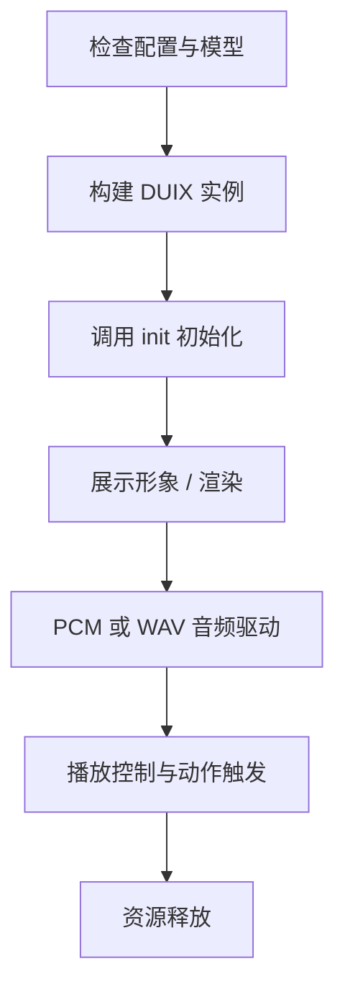

# Duix Mobile for iOS SDK ⽂档

简体中文 | [English](./README_en.md)

## 一、产品概述

`Duix Mobile for iOS` 是一套轻量级的本地部署 2D 虚拟人解决方案，适用于 iOS 端，支持通过语音实时驱动虚拟人形象进行口型播报和动作响应。

### 1.1 适用场景

- **部署成本低**：无服务端依赖，适用于政务终端、机场、展厅等场景。
- **弱网友好**：支持完全离线运行。
- **功能多样化**：支持导览播报、问答服务、数字迎宾等多种智能场景。

### 1.2 核心功能

- **数字人渲染与驱动**：支持本地渲染虚拟人形象，响应语音输入实时口型驱动；
- **语音播报控制**：支持音频播放、PCM 推流、动作与播报联动；
- **动作控制系统**：可自定义启动、停止、随机动作；


---

## 二、术语说明

| 术语           | 含义                                                         |
|----------------|--------------------------------------------------------------|
| PCM            | 原始音频流格式（16kHz，16bit，Mono）                        |
| WAV            | 音频文件格式，适用于短语音播放，内部仍为 PCM 编码         |
| Session        | 一次完整播报流程（推送→响应→结束）                         |
| DUIX-PRO       | 本地渲染与驱动管理器，实现模型加载、渲染控制、播报驱动等功能 |
| GJLPCMManager  | 提供的 PCM 管理类，用于处理音频文件和推送逻辑          |

---

## 三、SDK 获取与集成


### 3.1 手动集成（推荐）

1. 将 `GJLocalDigitalSDK.framework` 拖入 Xcode 项目中，设置为：**Embed & Sign**。
2. 在 `Build Phases > Link Binary With Libraries` 中添加：`AVFoundation.framework`。
3. Info.plist 中添加麦克风权限：

```xml
<key>NSMicrophoneUsageDescription</key>
<string>App需要使用麦克风权限驱动数字人语音播报</string>
```

---

## 四、集成要求

| 项目         | 要求                           |
|--------------|----------------------------------|
| 系统版本     | iOS 12.0 及以上                  |
| 开发工具     | Xcode 12 及以上                  |
| 支持设备     | iPhone 8 及以上                  |
| 运行环境     | 支持离线，无需联网               |
| CPU 与内存   | 推荐 A12 芯片及以上，内存 ≥ 3GB |

---


## 五、使用流程概览



---

## 六、快速开始示例
```objc
NSInteger result = [[GJLDigitalManager manager] initBaseModel:basePath 
                                                 digitalModel:digitalPath 
                                                    showView:self.showView];
if (result == 1) {
    [[GJLDigitalManager manager] toStart:^(BOOL isSuccess, NSString *errorMsg) {
        if (isSuccess) {
            [[GJLDigitalManager manager] toStartRuning];
        } else {
            NSLog(@"启动失败：%@", errorMsg);
        }
    }];
}
```

> 注意：basePath 为基础资源目录，digitalPath 为模型目录

---

## 七、关键接口与使用说明


### 7.1 初始化配置

```
/**
 * 初始化数字人服务
 * @param basePath    基础模型路径（固定不变）
 * @param digitalPath 数字人模型路径（替换数字人时更新此路径）
 * @param showView    数字人渲染视图
 * @return 状态码 1=成功, 0=未授权, -1=失败
 */
-(NSInteger)initBaseModel:(NSString*)basePath digitalModel:(NSString*)digitalPath showView:(UIView*)showView;
```


### 7.2 渲染数字人控制

```
/*
*启动数字人渲染
*/
-(void)toStart:(void (^) (BOOL isSuccess, NSString *errorMsg))block;
```


```
/*
*停止渲染并释放资源
*/
-(void)toStop;
```


```
/*
*恢复播放（暂停后调用）
*/
-(void)toPlay;
```

```
/*
*暂停数字人播放
*/
-(void)toPause;
```


### 7.3 背景管理

```
/**
 * 动态替换背景
 * @param bbgPath JPG格式背景图路径
 */
-(void)toChangeBBGWithPath:(NSString*)bbgPath;
```


### 7.4 音频播报控制

```
/*
*audioData播放音频流 ，参考demo里面GJLPCMManager类里toSpeakWithPath 转换成pcm的代码
*驱动数字人播报(PCM流)
*/
-(void)toWavPcmData:(NSData*)audioData;
```

```
/*
* 开始音频流播放
*/
- (void)startPlaying;
```


```
/*
* 结束音频流播放
*/
- (void)stopPlaying:(void (^)( BOOL isSuccess))success;
```


```
/*
*设置静音模式
*/
-(void)toMute:(BOOL)isMute;
```

```
/*
*清空音频缓冲区
*/
-(void)clearAudioBuffer;
```

```
/*
*暂停播放音频流
*/
-(void)toPausePcm;
```


```
/*
*恢复播放音频流
*/
-(void)toResumePcm;
```

```
/*
* 是否启用录音
*/
-(void)toEnableRecord:(BOOL)isEnable;
```


### 7.5 流式会话管理
```
/*
*启动流式会话
*/
-(void)toStartRuning;
```

```
/*
*开始新会话（单句/段落）
*/
-(void)newSession;
```

```
/*
*结束当前会话
*/
-(void)finishSession;
```


```
/*
*继续会话（finish后调用）
*/
-(void)continueSession;
```


### 7.6 动作控制

```
/*
* 启用随机动作（建议在首段音频开始时调用）
* 返回：0=不支持, 1=成功
*/
-(NSInteger)toRandomMotion;
```

```
/*
* 启用开始动作（首段音频开始时调用）
* 返回：0=不支持, 1=成功
*/
-(NSInteger)toStartMotion;
```

```
/*
* 结束动作（末段音频结束时调用）
*isQuickly: YES=立即结束, NO=等待动作完成
*返回：0=不支持, 1=成功
*/
-(NSInteger)toSopMotion:(BOOL)isQuickly;
```

### 7.7 状态查询

```
/*
*获取数字人模型尺寸（需初始化后调用）
*/ 
-(CGSize)getDigitalSize;
```

```
/*
*检查授权状态（1=已授权）
*/ 
-(NSInteger)isGetAuth;
```

---

## 八、回调定义

```
/*
*数字人渲染报错
*错误码说明：
*    0  = 未授权 
*   -1 = 未初始化 
*   50009 = 资源超时/未配置
*/
@property (nonatomic, copy) void (^playFailed)(NSInteger code,NSString *errorMsg);

/*
*音频播放结束回调
*/
@property (nonatomic, copy) void (^audioPlayEnd)(void);

/*
*音频播放进度回调
/
@property (nonatomic, copy) void (^audioPlayProgress)(float current,float total);
```

---

## 九、常见问题与排查指南

| 问题现象           | 可能原因               | 建议处理方式                         |
|--------------------|------------------------|--------------------------------------|
| 初始化返回 -1      | SDK 授权失败            | 检查 info.plist 是否包含授权字段      |
| 无法渲染画面        | showView 为空或未添加   | 确保 viewController 中已渲染视图挂载 |
| 播报无响应          | 音频格式错误或路径无效   | 确保 PCM 格式正确 / 路径有效         |
| 播放提前中断        | 会话未续接 / 缓冲区溢出   | 检查是否正确调用 `continueSession`   |

---

## 十、版本更新记录

### v1.2.3

- 新增 支持 128模型

### v1.2.0

- 新增 PCM 推流支持

### v1.0.3

- 支持透明背景
- 优化模型解压内存

### v1.0.2

- 支持问答 / 语音识别 / 动作标注 / 合成播报

### v1.0.1

- 初始版本：授权 + 渲染 + 播报

---

## 🔗 开源依赖

| 模块                                      | 描述                         |
|-------------------------------------------|------------------------------|
| [ONNX](https://github.com/onnx/onnx)      | 通用 AI 模型标准格式         |
| [ncnn](https://github.com/Tencent/ncnn)   | 高性能神经网络推理框架（腾讯） |

---

如需更多集成帮助，请联系技术支持。
