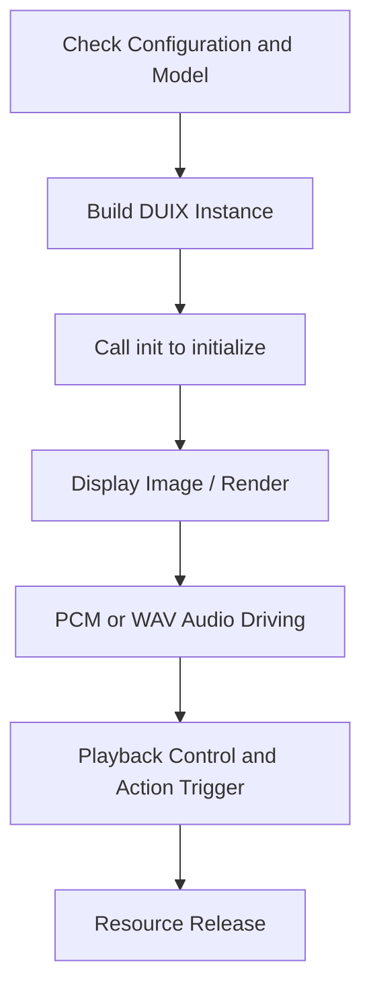

# Duix Mobile for iOS SDK Documentation

English | [中文](./README_zh.md)

## 1. Product Overview

`Duix Mobile for iOS` is a lightweight, locally deployed 2D digital human solution for iOS, supporting real-time avatar lip-sync and motion response driven by voice.

### 1.1 Application Scenarios

- **Low deployment cost**: No server dependency, suitable for government terminals, airports, exhibition halls, and more.
- **Offline friendly**: Fully offline operation supported.
- **Diverse functionality**: Supports guided broadcasting, Q&A services, digital reception, and other intelligent scenarios.

### 1.2 Core Features

- **Digital human rendering and driving**: Supports local avatar rendering, real-time lip-sync driven by voice input.
- **Voice playback control**: Supports audio playback, PCM streaming, and action-broadcast linkage.
- **Motion control system**: Customizable start, stop, and random actions.

---

## 2. Terminology

| Term            | Description                                                                 |
|-----------------|-----------------------------------------------------------------------------|
| PCM             | Raw audio stream format (16kHz, 16bit, Mono)                                |
| WAV             | Audio file format suitable for short voice playback (internally PCM encoded)|
| Session         | Complete broadcast process (Push → Response → End)                          |
| DUIX-PRO        | Local rendering and driving manager handling model loading, render control, etc. |
| GJLPCMManager   | PCM management class for handling audio files and streaming logic           |

---

## 3. SDK Acquisition & Integration

### 3.1 Manual Integration (Recommended)

1. Drag `GJLocalDigitalSDK.framework` into Xcode project → Set to **Embed & Sign**
2. Add `AVFoundation.framework` in `Build Phases > Link Binary With Libraries`
3. Add microphone permission in Info.plist:

```xml
<key>NSMicrophoneUsageDescription</key>
<string>App requires microphone access to drive digital human voice broadcast</string>
```

---

## 4. Integration Requirements

| Item           | Requirement                              |
|----------------|------------------------------------------|
| OS Version     | iOS 12.0+                                |
| Development Tools | Xcode 12+                                |
| Supported Devices | iPhone 8+                                |
| Runtime Environment | Offline operation (no network required)  |
| CPU & Memory   | Recommended A12+ chip, ≥3GB RAM          |

---

## 5. Workflow Overview



---

## 6. Quick Start Example

```
NSInteger result = [[GJLDigitalManager manager] initBaseModel:basePath 
                                                 digitalModel:digitalPath 
                                                    showView:self.showView];
if (result == 1) {
    [[GJLDigitalManager manager] toStart:^(BOOL isSuccess, NSString *errorMsg) {
        if (isSuccess) {
            [[GJLDigitalManager manager] toStartRuning];
        } else {
            NSLog(@"Start failed: %@", errorMsg);
        }
    }];
}

```
> Note: basePath = base resource directory, digitalPath = model directory

---

## 7. Key Interfaces & Usage

### 7.1 Initialization Configuration

```
/**
 * Initialize digital human service
 * @param basePath    Base model path (fixed)
 * @param digitalPath Digital human model path (update when replacing digital human)
 * @param showView    Digital human rendering view
 * @return Status code 1=success, 0=unauthorized, -1=failure
 */
-(NSInteger)initBaseModel:(NSString*)basePath digitalModel:(NSString*)digitalPath showView:(UIView*)showView;
```

### 7.2 Digital Human Rendering Control

```
/*
* Start digital human rendering
*/
-(void)toStart:(void (^) (BOOL isSuccess, NSString *errorMsg))block;
```

```
/*
* Stop rendering and release resources
*/
-(void)toStop;
```

```
/*
* Resume playback (call after pause)
*/
-(void)toPlay;
```

```
/*
* Pause digital human playback
*/
-(void)toPause;
```

### 7.3 Background Management

```
/**
 * Dynamically replace background
 * @param bbgPath JPG format background image path
 */
-(void)toChangeBBGWithPath:(NSString*)bbgPath;
```

### 7.4 Audio Control

```
/*
* Play audio stream (PCM format), refer to toSpeakWithPath in GJLPCMManager demo class for PCM conversion
* Drive digital human broadcast (PCM stream)
*/
-(void)toWavPcmData:(NSData*)audioData;
```

```
/*
* Start audio stream playback
*/
- (void)startPlaying;
```

```
/*
* Stop audio stream playback
*/
- (void)stopPlaying:(void (^)( BOOL isSuccess))success;
```

```
/*
* Set mute mode
*/
-(void)toMute:(BOOL)isMute;
```

```
/*
* Clear audio buffer
*/
-(void)clearAudioBuffer;
```

```
/*
* Pause audio stream playback
*/
-(void)toPausePcm;
```

```
/*
* Resume audio stream playback
*/
-(void)toResumePcm;
```

```
/*
* Enable/disable recording
*/
-(void)toEnableRecord:(BOOL)isEnable;
```

### 7.5 Streaming Session Management

```
/*
* Start streaming session
*/
-(void)toStartRuning;
```

```
/*
* Start new session (single sentence/paragraph)
*/
-(void)newSession;
```

```
/*
* End current session
*/
-(void)finishSession;
```

```
/*
* Continue session (call after finish)
*/
-(void)continueSession;
```

### 7.6 Motion Control

```
/*
* Enable random motions (recommended at start of first audio segment)
* Return: 0=unsupported, 1=success
*/
-(NSInteger)toRandomMotion;
```

```
/*
* Enable start motion (call at beginning of first audio segment)
* Return: 0=unsupported, 1=success
*/
-(NSInteger)toStartMotion;
```

```
/*
* End motion (call at end of last audio segment)
* isQuickly: YES=end immediately, NO=wait for motion completion
* Return: 0=unsupported, 1=success
*/
-(NSInteger)toSopMotion:(BOOL)isQuickly;
```

### 7.7 Status Queries

```
/*
* Get digital human model dimensions (call after initialization)
*/ 
-(CGSize)getDigitalSize;
```

```
/*
* Check authorization status (1=authorized)
*/ 
-(NSInteger)isGetAuth;
```

---

## 8. Callback Definitions

```
/*
* Digital human rendering error
* Error codes:
*    0  = Unauthorized 
*   -1 = Uninitialized 
*   50009 = Resource timeout/unconfigured
*/
@property (nonatomic, copy) void (^playFailed)(NSInteger code,NSString *errorMsg);
```

```
/*
* Audio playback ended callback
*/
@property (nonatomic, copy) void (^audioPlayEnd)(void);
```

```
/*
* Audio playback progress callback
*/
@property (nonatomic, copy) void (^audioPlayProgress)(float current,float total);
```

---

## 9. FAQ & Troubleshooting

| Symptom               | Possible Cause               | Recommended Solution               |
|-----------------------|------------------------------|------------------------------------|
| Initialization returns -1 | SDK authorization failed   | Check info.plist for auth fields   |
| No rendered output     | showView empty or not added | Ensure view is mounted in controller |
| No broadcast response  | Invalid audio format/path   | Verify PCM format/path validity    |
| Premature playback stop| Session not continued/buffer overflow | Check `continueSession` usage     |

## 10. Version History

### v1.2.3

- Added support for 128 models

### v1.2.0

- Added PCM streaming support

### v1.0.3

- Supported transparent backgrounds
- Optimized model decompression memory

### v1.0.2

- Supported Q&A / speech recognition / motion tagging / synthesized broadcast

### v1.0.1

- Initial version: authorization + rendering + broadcast

---

## 🔗 Open Source Dependencies

| Module                                   | Description                      |
|------------------------------------------|----------------------------------|
| [ONNX](https://github.com/onnx/onnx)     | Universal AI model format        |
| [ncnn](https://github.com/Tencent/ncnn)  | High-performance neural network inference framework (Tencent) |
 
For additional integration support, please contact technical support.
